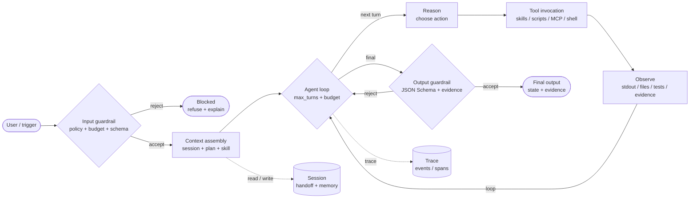
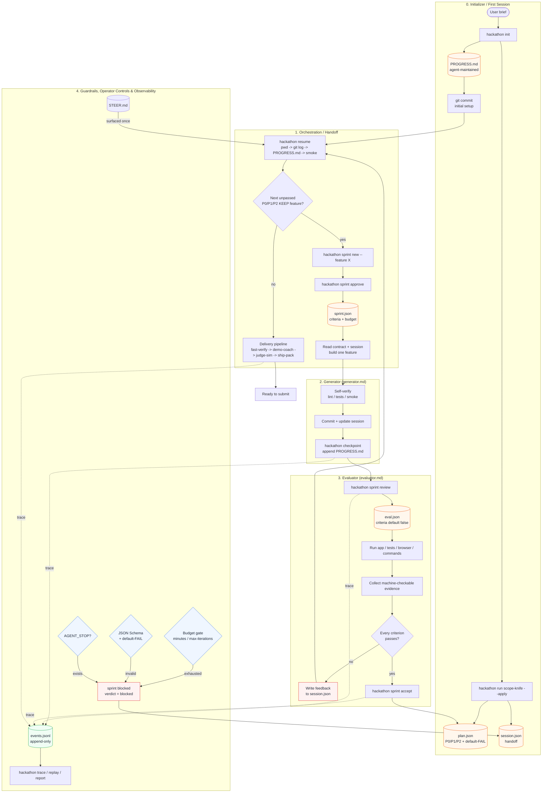
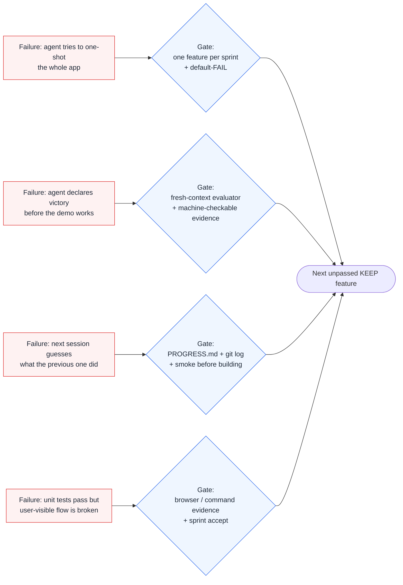
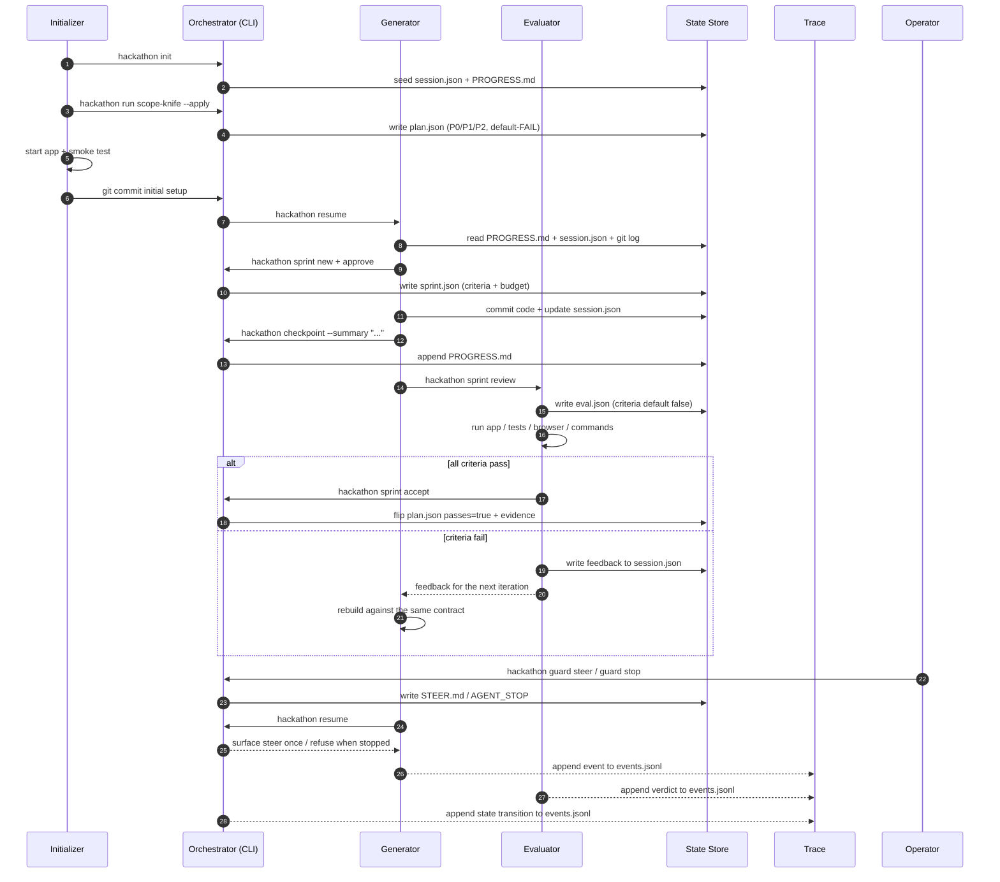

# 🏁 Hackathon Run

> **Ship the demo, not the dream.**

A decision-making and execution system for hackathon teams operating under time pressure. Fifteen skills, one workflow: **clarify, prize-target, scope, time-box, build, verify, demo, judge, ship, recover, pivot, retro, decide-log.**

[](https://github.com/MAGA2010/hackathon-run/actions)
[](CHANGELOG.md)
[](https://opensource.org/licenses/MIT)
[](https://github.com/MAGA2010/hackathon-run)
[](https://www.npmjs.com/package/@hackathon-run/hackathon-run)
[](https://www.npmjs.com/package/@hackathon-run/hackathon-run)
[](https://github.com/MAGA2010/hackathon-run/releases/latest)

<p align="center">
  
</p>

---

## The problem

A hackathon is not a coding problem. It is a **time-pressure, decision-making, execution** problem.

- 23 hours in, you have 8 unfinished features.
- The demo crashes on stage and you have 60 seconds to recover.
- A judge asks "what's novel here?" and you have no answer.
- Your README references API keys that you cannot ship.
- Your teammate has been debugging the wrong thing for 4 hours.

**Hackathon Run does not help you write code faster.** It helps you **make the right cut, at the right time, every time**.

---

## How it works

Fifteen skills, mapped to the hackathon lifecycle:

`   idea-clarify (pre)             pivot (mid-build redirect)
              │                              │
              ▼                              ▼
   scope-knife ─► time-box ─► fast-verify ─► demo-coach ─► judge-sim ─► ship-pack
        │              │            │              │             │            │
        └──────────────┴────────────┴──────────────┴─────────────┴────────────┘
        │             │         │             │           │             │      
        stack-picker (cold-start)                         retro (post-event)   
                      │         │             │                         │      
                                team-roster (build start)               recovery-runbook (anytime)
                      │                       │                                
                                              demo-rehearsal (final 2h)        `

| Skill                | When                                              | Output                                              |
| -------------------- | ------------------------------------------------- | --------------------------------------------------- |
| **idea-clarify**     | One-paragraph brief, no demo_goal yet             | (artifact only)                                     |
| **scope-knife**      | Too many ideas, no MVP consensus, clock shrinking | KEEP/CUT/DEFER classification + demo path           |
| **fast-verify**      | "Will this demo work?"                            | Step-by-step verification, stops at first failure   |
| **demo-coach**       | 30/60/90-second pitch, no clear narrative         | Flow script + risk flags                            |
| **judge-sim**        | Pre-submission self-review                        | 0-5 rating across 7 dimensions + fix priorities     |
| **ship-pack**        | Submitting now, worried about secrets             | README check, secret scan, packaging command        |
| **recovery-runbook** | Demo fails on stage                               | P0-P3 severity, fallback strategy, 30-second script |
| **pivot**            | Mid-build direction change                        | Re-runs scope-knife with new constraints            |
| **time-box**         | "How much time for each stage?"                   | Schedule + per-stage checkpoints                    |
| **stack-picker**     | "What stack should we use?"                       | Recommendation + 30-min bootstrap walkthrough       |
| **retro**            | After submission, want ratios + action list       | 4 ratios + keep_doing/stop_doing/try_next_time      |
| **demo-rehearsal**   | Final 2 hours, want a timed mock run              | Per-segment score + fix list                        |
| **team-roster**      | Build phase, >2 KEEP features, roles unclear      | Role assignments + bottleneck + rescuer             |
| **prize-strategy**   | Multi-track hackathon, picks which prize to chase | Target prize + 3-5 positioning actions              |
| **decision-log**     | Every cut needs a recorded "why"                  | Append-only decision record with rationale          |

Each skill is **independently invokable**. You can run any of them at any time without running the others.

---

## Agent workflow

Hackathon Run works best when an agent treats it as a **harness**, not as a
menu of one-shot prompts. Four roles keep long-running work moving without
letting the same agent both build and approve its own output: an initializer
sets up the first session, a planner writes the default-FAIL contract, a
generator builds one feature per sprint, and an evaluator verifies it from a
fresh context.

The runtime follows the production agent-loop pattern used by ChatGPT and the
OpenAI Agents SDK: context is assembled from sessions, every input and output
passes a guardrail, tools return observable results, the loop is bounded by
budget, and every meaningful step is traced. It also follows Anthropic's
long-running harness pattern: the first session initializes the environment,
every later session reads `PROGRESS.md` + git log, and the operator can stop or
steer the loop from the outside.

### Production agent loop



### Hackathon Run runtime

The same loop is implemented concretely by the harness. Each arrow below is a
real command, state artifact, or feedback handoff:



### Failure modes to harness gates

The diagram below maps the paper's failure modes to the exact gate that stops
each one:



### Command timeline

The same loop at command level, including the failed-iteration feedback path:



### Production primitives mapped to Hackathon Run

| OpenAI / ChatGPT agent primitive | Hackathon Run implementation                                                       |
| -------------------------------- | ---------------------------------------------------------------------------------- |
| Initializer agent                | `agents/initializer.md` + `hackathon init` + first clean git commit                |
| Agent loop                       | `sprint new -> build -> review -> accept`                                          |
| Context assembly                 | `session.json` + `plan.json` + active `SKILL.md` before the first turn             |
| Sessions                         | `session.json` + `PROGRESS.md` handoff + `hackathon resume`                        |
| Agent-maintained handoff         | `PROGRESS.md` + `hackathon checkpoint --summary`                                   |
| Handoffs                         | Initializer -> Planner -> Generator -> Evaluator -> Delivery                       |
| Guardrails                       | JSON Schema validation, default-FAIL, trigger budget, fresh-context evaluator      |
| Budget / max turns               | `sprint budget --minutes --max-iterations`; exhausted budget becomes `blocked`     |
| Operator controls                | `hackathon guard stop/clear/steer/status` -> `AGENT_STOP` / `STEER.md`             |
| Tools                            | bundled skills, scripts, MCP tools                                                 |
| Tracing                          | append-only `events.jsonl` + `hackathon trace`                                     |
| Failure policy                   | failing eval writes feedback to `session.json`; the next loop starts there         |
| Failure-mode gates               | one feature per sprint, fresh evaluator, `PROGRESS.md` + git log, browser evidence |
| Final output                     | validated state files + `report`                                                   |

### Runtime command map

| Phase      | Command                                                     | State artifact                                             |
| ---------- | ----------------------------------------------------------- | ---------------------------------------------------------- |
| Init       | `hackathon init`                                            | `.hackathon/`, `session.json`, `SESSION.md`, `PROGRESS.md` |
| Plan       | `hackathon run scope-knife --apply`                         | `plan.json` with `passes: false`                           |
| Resume     | `hackathon resume`                                          | `session.json` + `PROGRESS.md` handoff                     |
| Checkpoint | `hackathon checkpoint --summary`                            | `PROGRESS.md`, `session.json`                              |
| Contract   | `hackathon sprint new` + `hackathon sprint approve`         | `sprint.json`                                              |
| Review     | `hackathon sprint review`                                   | `eval.json` with default-FAIL criteria                     |
| Accept     | `hackathon sprint accept`                                   | `plan.json`, `sprint.json`, `session.json`                 |
| Guard      | `hackathon guard stop/clear/steer/status`                   | `AGENT_STOP`, `STEER.md`                                   |
| Verify     | `hackathon run fast-verify`                                 | `verify.json`                                              |
| Ship       | `hackathon flow --execute`                                  | `demo.json`, `review.json`, `ship.json`                    |
| Observe    | `hackathon trace` / `hackathon replay` / `hackathon report` | `events.jsonl` + report                                    |

| Role          | Responsibility                                                                                               | Must not do                                                      |
| ------------- | ------------------------------------------------------------------------------------------------------------ | ---------------------------------------------------------------- |
| **Planner**   | Expand a short brief into a concrete demo goal, KEEP/CUT/DEFER list, and demo path.                          | Write implementation details or mark features as passing.        |
| **Generator** | Resume from `session.json`, pick one unpassed KEEP feature, agree a sprint contract, and build it.           | Set `passes: true` or approve its own work.                      |
| **Evaluator** | Read only. Run the app like a user, collect machine-checkable evidence, and return a hard pass/fail verdict. | Edit code or state, lower a threshold, or pass without evidence. |

The harness runtime turns those roles into durable artifacts:

- `plan.json` is a **default-FAIL contract**. Every KEEP feature starts with
  `passes: false`; only evidence-backed evaluation can flip it.
- `session.json` is the **handoff**. A fresh agent reads it to resume work
  without replaying the previous conversation.
- `sprint.json` is the **definition of done**. The generator and evaluator
  agree on criteria before code is written.
- `eval.json` is the **evaluator verdict**. Failed criteria return actionable
  feedback to the generator for the next iteration.
- `events.jsonl` is the **append-only trace**. `hackathon trace`, `replay`,
  and `report` reconstruct what actually happened.

```bash
# One complete agent loop
hackathon init
hackathon run scope-knife --demo-goal "sign up + save note" --time-remaining 240 --apply
hackathon resume
hackathon sprint new --feature Auth
hackathon sprint approve

# Generator builds Auth against the contract, then:
hackathon sprint review

# Evaluator fills .hackathon/state/eval.json with evidence and feedback, then:
hackathon sprint accept
hackathon trace
hackathon flow --execute
```

`sprint accept` applies the evaluator verdict: a passing eval flips the
feature to `passes: true` and records evidence; a failing eval writes feedback
back to `session.json` for the next generator iteration.

Cost and time are first-class gates. Set them when creating a sprint:

```bash
hackathon sprint budget --minutes 45 --max-iterations 3
```

Trace is on by default for initialized projects. Disable it with
`HACKATHON_TRACE=0` when you do not want runtime event noise.

Run an A/B measurement before adding more harness machinery:

```bash
npm run ab:harness -- \
  --solo-command "hackathon run scope-knife" \
  --harness-command "hackathon flow --execute"
```

---

## 30-second quickstart

```bash

# Option A -- one-shot via npx (no install needed)

npx @hackathon-run/hackathon-run init

# Option B -- install globally, then use hackathon as the CLI command

npm install -g @hackathon-run/hackathon-run
hackathon init

# Option C -- from source

git clone https://github.com/MAGA2010/hackathon-run
cd hackathon-run
npm install
npm run build
npm link

# Inside any hackathon project

cd my-hackathon-project
hackathon init # creates .hackathon/ in your repo
hackathon run scope-knife # forces a KEEP/CUT/DEFER decision
hackathon run fast-verify # verifies the demo path
hackathon run demo-coach # drafts the pitch
hackathon run judge-sim # self-reviews before submitting
hackathon run ship-pack # packages and checks for leaks
hackathon resume # handoff brief for a fresh agent or new session
hackathon sprint new --feature Auth # create a default-FAIL contract
hackathon sprint approve # lock the contract before building
hackathon sprint review # emit the evaluator handoff
# Evaluator fills eval.json, then:
hackathon sprint accept # apply the verdict back to plan/session
hackathon trace # inspect the runtime event log

# Chained run: follows Format v2 dependencies automatically
hackathon run demo-rehearsal --chain # scope-knife -> fast-verify -> demo-coach -> demo-rehearsal
```

State is saved to .hackathon/state/ and is never required by the next step.

After install, the CLI command is hackathon (not hackathon-run). The package is @hackathon-run/hackathon-run; the binary is hackathon.

For CI, run hackathon skills lint to validate every bundled skill in one shot. Pin the team's skill versions for reproducibility with hackathon skills pin --all. Opt into a semantic matcher by setting HACKATHON_EMBED_BACKEND to an HTTP ranking endpoint.

Third-party skills can ship a full manifest (`license`, `author`, `homepage`, `repository`, `compatibility`) that `hackathon skills search --json` and the `find_skills` MCP tool surface.

---

## The design rules (non-negotiable)

1. **Each skill is independently usable.** No forced flow. Run any skill at 2am without reading the docs first.
2. **State lives in the filesystem** (.hackathon/state/*.json), readable, never blocking.
3. **Trigger phrases in every description** so the agent can match intent without ambiguity.
4. **Body = execution logic only.** No backstory, no changelogs inside skill files.
5. **v1 ships a small set of skills done well**, not 100 stubs.
6. **Acceptance criteria live in the skill file** and are wired to shell tests.

---

## Documentation

Full docs in [docs/index.md](docs/index.md). (A hosted site is not deployed yet.)

- [Getting Started](docs/getting-started/installation.md)
- [36-Hour Walkthrough](docs/guides/36-hour-walkthrough.md)
- [Skill Reference](docs/skills/scope-knife.md)
- [Architecture](docs/architecture/overview.md)
- [Contributing](docs/contributing/contributing.md)

---

## Contributing

We welcome skill proposals, bug fixes, and docs improvements. See [CONTRIBUTING.md](CONTRIBUTING.md).

The [skill template](docs/contributing/skill-template.md) is the source of truth for adding new skills.

---

## License

[MIT](LICENSE) — © 2025-2026 MAGA2010

---

## Star history

<a href="https://star-history.com/#MAGA2010/hackathon-run&Date">
  <picture>
    <source media="(prefers-color-scheme: dark)" srcset="https://api.star-history.com/svg?repos=MAGA2010/hackathon-run&type=Date&theme=dark" />
    <source media="(prefers-color-scheme: light)" srcset="https://api.star-history.com/svg?repos=MAGA2010/hackathon-run&type=Date" />
    
  </picture>
</a>
