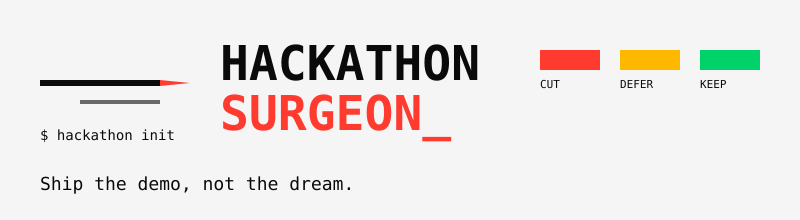

# Hackathon Run

> **Ship the demo, not the dream.**

A decision-making and execution system for hackathon teams operating under
time pressure. Fourteen skills, one workflow: **clarify, scope, time-box,
build, verify, demo, judge, ship, recover, pivot, retro, decide-log.**



## The problem

A hackathon is not a coding problem. It is a **time-pressure, decision-making,
execution** problem.

- 23 hours in, you have 8 unfinished features.
- The demo crashes on stage and you have 60 seconds to recover.
- A judge asks "what's novel here?" and you have no answer.

Hackathon Run does not help you write code faster. It helps you **make the
right cut, at the right time, every time**.

## Quick start

```bash
npm install -g @maga2010/hackathon-run
cd my-hackathon-project
hackathon init
hackathon run scope-knife
hackathon skills search --tag mvp
hackathon run demo-rehearsal --chain
```

## The fourteen skills

| Skill                                          | When                                  | Output                                   |
| ---------------------------------------------- | ------------------------------------- | ---------------------------------------- |
| [idea-clarify](skills/idea-clarify.md)         | One-paragraph brief, no demo goal yet | Concrete demo goal                       |
| [scope-knife](skills/scope-knife.md)           | Too many ideas, no MVP consensus      | KEEP/CUT/DEFER + demo path               |
| [time-box](skills/time-box.md)                 | "How much time for each stage?"       | Stage schedule + checkpoints             |
| [stack-picker](skills/stack-picker.md)         | No tech-stack preference yet          | Recommendation + bootstrap walkthrough   |
| [team-roster](skills/team-roster.md)           | Build phase, roles unclear            | Roles + bottleneck + rescuer             |
| [fast-verify](skills/fast-verify.md)           | "Will this demo work?"                | Step-by-step verification                |
| [demo-coach](skills/demo-coach.md)             | 30/60/90-second pitch                 | Flow script + risk flags                 |
| [demo-rehearsal](skills/demo-rehearsal.md)     | Final 2 hours, timed mock run         | Per-segment score + fix list             |
| [judge-sim](skills/judge-sim.md)               | Pre-submission self-review            | 7-dimension score + fix priorities       |
| [ship-pack](skills/ship-pack.md)               | Submitting now                        | README check, secret scan, packaging     |
| [recovery-runbook](skills/recovery-runbook.md) | Live demo fails                       | P0-P3 fallback + 30-second script        |
| [pivot](skills/pivot.md)                       | Mid-build direction change            | Re-runs scope-knife with new constraints |
| [retro](skills/retro.md)                       | After submission                      | 4 ratios + keep/stop/try-next list       |
| [decision-log](skills/decision-log.md)         | Every cut needs a recorded why        | Append-only rationale record             |

## Discovery and automation

- `hackathon list` and `hackathon skills search` find the right skill by
  category, tag, dependency, or side effect.
- `hackathon skills graph` renders the dependency and state-write graphs.
- `hackathon run <skill> --chain` runs dependencies in topological order.
- `hackathon skills pin` snapshots per-skill versions for CI reproducibility.
- `hackathon doctor`, `hackathon status`, `hackathon replay`, and
  `hackathon report` inspect a run without leaving the terminal.
- Third-party skills can ship a full manifest (`license`, `author`,
  `homepage`, `repository`, `compatibility`) surfaced by
  `hackathon skills search --json` and the `find_skills` MCP tool.

## Where to go next

- [Installation](getting-started/installation.md)
- [Quickstart](getting-started/quickstart.md)
- [36-hour walkthrough](guides/36-hour-walkthrough.md)
- [Skill reference](skills/index.md)
- [Architecture overview](architecture/overview.md)
- [Contributing](contributing/contributing.md)
