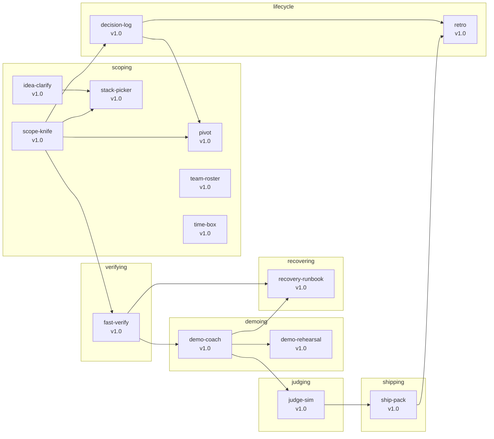

## Skill dependency graph

```mermaid
flowchart LR
  subgraph scoping["scoping"]
    idea_clarify["idea-clarify<br/>v1.0"]:::#dae8fc
    pivot["pivot<br/>v1.0"]:::#dae8fc
    scope_knife["scope-knife<br/>v1.0"]:::#dae8fc
    stack_picker["stack-picker<br/>v1.0"]:::#dae8fc
    team_roster["team-roster<br/>v1.0"]:::#dae8fc
    time_box["time-box<br/>v1.0"]:::#dae8fc
  end
  subgraph verifying["verifying"]
    fast_verify["fast-verify<br/>v1.0"]:::#fff2cc
  end
  subgraph demoing["demoing"]
    demo_coach["demo-coach<br/>v1.0"]:::#f8cecc
    demo_rehearsal["demo-rehearsal<br/>v1.0"]:::#f8cecc
  end
  subgraph judging["judging"]
    judge_sim["judge-sim<br/>v1.0"]:::#e1d5e7
  end
  subgraph shipping["shipping"]
    ship_pack["ship-pack<br/>v1.0"]:::#fad7ac
  end
  subgraph recovering["recovering"]
    recovery_runbook["recovery-runbook<br/>v1.0"]:::#cce5ff
  end
  subgraph lifecycle["lifecycle"]
    decision_log["decision-log<br/>v1.0"]:::#f0f0f0
    retro["retro<br/>v1.0"]:::#f0f0f0
  end
  scope_knife --> decision_log
  fast_verify --> demo_coach
  demo_coach --> demo_rehearsal
  scope_knife --> fast_verify
  demo_coach --> judge_sim
  scope_knife --> pivot
  decision_log --> pivot
  fast_verify --> recovery_runbook
  demo_coach --> recovery_runbook
  decision_log --> retro
  ship_pack --> retro
  judge_sim --> ship_pack
  idea_clarify --> stack_picker
  scope_knife --> stack_picker
```
