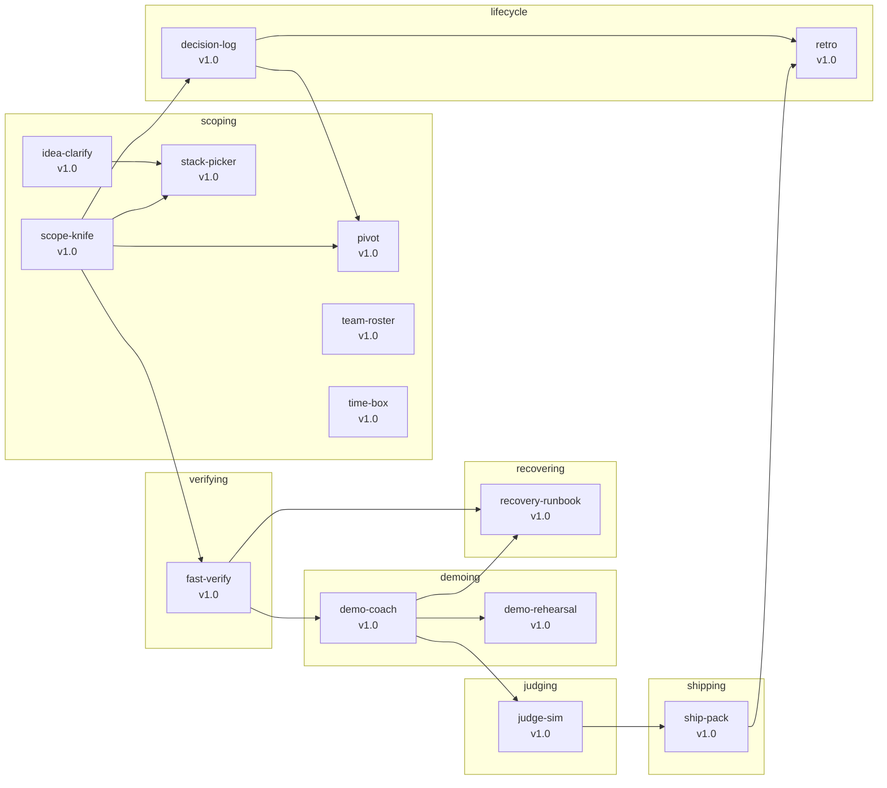
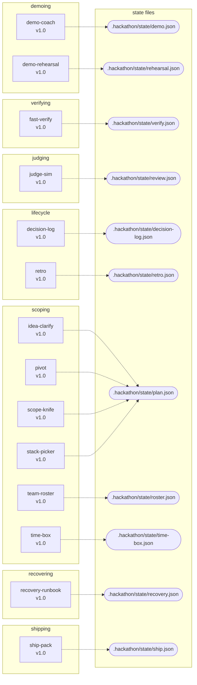

# Skills

Each skill is a self-contained `SKILL.md` plus, where helpful, Python scripts and
references. Skills are designed to be invoked by an agent that reads the
SKILL.md, runs the scripts, and writes the state file at the path the contract
specifies.

| Skill                                   | One-line summary                                            | Output state        |
| --------------------------------------- | ----------------------------------------------------------- | ------------------- |
| [idea-clarify](idea-clarify.md)         | Surface a one-paragraph brief into a concrete demo goal     | (artifact only)     |
| [scope-knife](scope-knife.md)           | Force a KEEP/CUT/DEFER decision on every feature            | `plan.json`         |
| [fast-verify](fast-verify.md)           | Run each `demo_path` step end-to-end                        | `verify.json`       |
| [demo-coach](demo-coach.md)             | Generate a 30/60/90-second pitch script                     | `demo.json`         |
| [judge-sim](judge-sim.md)               | Simulate a judge panel + score                              | `review.json`       |
| [ship-pack](ship-pack.md)               | Final ship audit (secrets, README, packaging)               | `ship.json`         |
| [recovery-runbook](recovery-runbook.md) | Detect a 2am-class failure and emit a runbook               | `recovery.json`     |
| [pivot](pivot.md)                       | Re-run scope-knife after a mid-build direction change       | (artifact only)     |
| [time-box](time-box.md)                 | Allocate remaining clock to each pipeline stage             | `time-box.json`     |
| [stack-picker](stack-picker.md)         | Recommend a tech stack when the team has no preference      | `stack.json`        |
| [retro](retro.md)                       | Post-event retrospective with 4 ratios + 3 buckets          | `retro.json`        |
| [demo-rehearsal](demo-rehearsal.md)     | Run a timed mock demo with stopwatch + per-segment fix list | `rehearsal.json`    |
| [team-roster](team-roster.md)           | Assign roles + detect the critical-path bottleneck          | `roster.json`       |
| [decision-log](decision-log.md)         | Log every KEEP/CUT/DEFER decision with rationale            | `decision-log.json` |

## How to read each page

Every skill page has the same six sections:

1. **Inputs** — required and optional fields, with types
2. **Outputs** — files produced (state + artifacts)
3. **Example** — a concrete input/output pair
4. **Trigger phrases** — utterances that should invoke the skill
5. **Acceptance criteria** — what counts as a successful run
6. **Failure modes** — how the skill reacts to common problems

## Skill format

Each skill's `SKILL.md` follows the [Hackathon Surgeon Skill Format
v2](../../architecture/skill-protocol.md#skill-format-v2), which extends YAML
frontmatter with `version`, `category`, `tags`, `dependencies`,
`side_effects`, and `triggers`. The fields drive the [linter
protocol](../../architecture/skill-protocol.md), the
[`hackathon skills search`](../cli-reference.md) subcommand, and the MCP
`find_skills` tool. See [ADR-0009](../../architecture/adr/0009-skill-format-v2.md)
for the design rationale.

## State machine

The dependency and state-write graphs below are **auto-derived** from the
Format v2 `dependencies` and `side_effects` frontmatter fields. Regenerate
with:

```bash
node scripts/regen-skill-graphs.mjs   # writes ./dependencies.md + ./state-writes.md
```

Or run them directly:

```bash
hackathon skills graph --format md --type deps   > docs/skills/dependencies.md
hackathon skills graph --format md --type effects > docs/skills/state-writes.md
```

### Dependency graph



### State-file writes



<!--
The two Mermaid blocks above are regenerated by `node scripts/regen-skill-graphs.mjs`.
Do not edit by hand; edit skills/*/SKILL.md `dependencies` and `side_effects` instead.
-->

Use [`hackathon status`](../architecture/overview.md) to see where you are in
this state machine, or [`hackathon flow`](../getting-started/quickstart.md) to get the exact commands for the
next stage.
