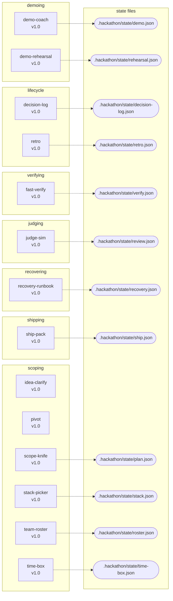

## State-file writes

```mermaid
flowchart LR
  subgraph scoping["scoping"]
    idea_clarify["idea-clarify<br/>v1.0"]:::#dae8fc
    pivot["pivot<br/>v1.0"]:::#dae8fc
    scope_knife["scope-knife<br/>v1.0"]:::#dae8fc
    stack_picker["stack-picker<br/>v1.0"]:::#dae8fc
    team_roster["team-roster<br/>v1.0"]:::#dae8fc
    time_box["time-box<br/>v1.0"]:::#dae8fc
  end
  subgraph verifying["verifying"]
    fast_verify["fast-verify<br/>v1.0"]:::#fff2cc
  end
  subgraph demoing["demoing"]
    demo_coach["demo-coach<br/>v1.0"]:::#f8cecc
    demo_rehearsal["demo-rehearsal<br/>v1.0"]:::#f8cecc
  end
  subgraph judging["judging"]
    judge_sim["judge-sim<br/>v1.0"]:::#e1d5e7
  end
  subgraph shipping["shipping"]
    ship_pack["ship-pack<br/>v1.0"]:::#fad7ac
  end
  subgraph recovering["recovering"]
    recovery_runbook["recovery-runbook<br/>v1.0"]:::#cce5ff
  end
  subgraph lifecycle["lifecycle"]
    decision_log["decision-log<br/>v1.0"]:::#f0f0f0
    retro["retro<br/>v1.0"]:::#f0f0f0
  end
  subgraph states["state files"]
    state_decision_log([".hackathon/state/decision-log.json"])
    state_demo([".hackathon/state/demo.json"])
    state_rehearsal([".hackathon/state/rehearsal.json"])
    state_verify([".hackathon/state/verify.json"])
    state_review([".hackathon/state/review.json"])
    state_recovery([".hackathon/state/recovery.json"])
    state_retro([".hackathon/state/retro.json"])
    state_plan([".hackathon/state/plan.json"])
    state_ship([".hackathon/state/ship.json"])
    state_stack([".hackathon/state/stack.json"])
    state_roster([".hackathon/state/roster.json"])
    state_time_box([".hackathon/state/time-box.json"])
  end
  decision_log -.-> state_decision_log
  demo_coach -.-> state_demo
  demo_rehearsal -.-> state_rehearsal
  fast_verify -.-> state_verify
  judge_sim -.-> state_review
  recovery_runbook -.-> state_recovery
  retro -.-> state_retro
  scope_knife -.-> state_plan
  ship_pack -.-> state_ship
  stack_picker -.-> state_stack
  team_roster -.-> state_roster
  time_box -.-> state_time_box
```
